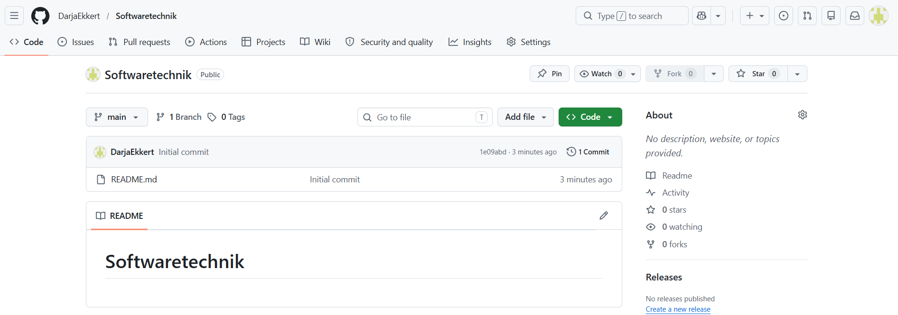
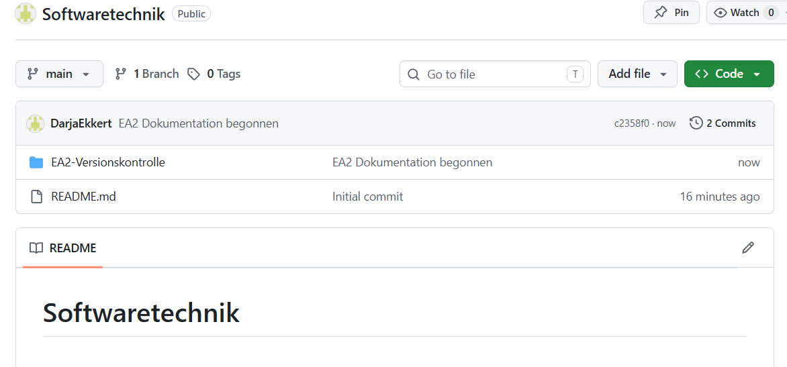
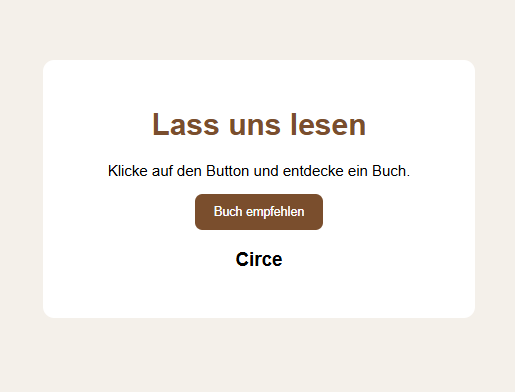
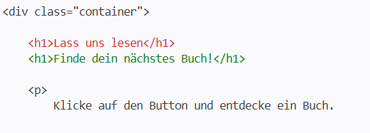
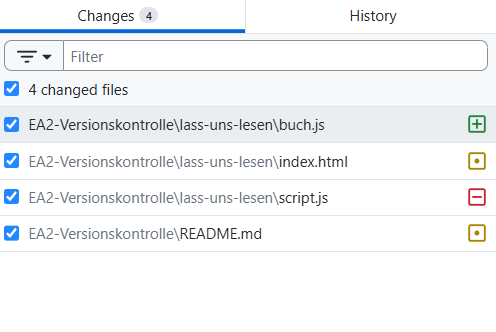
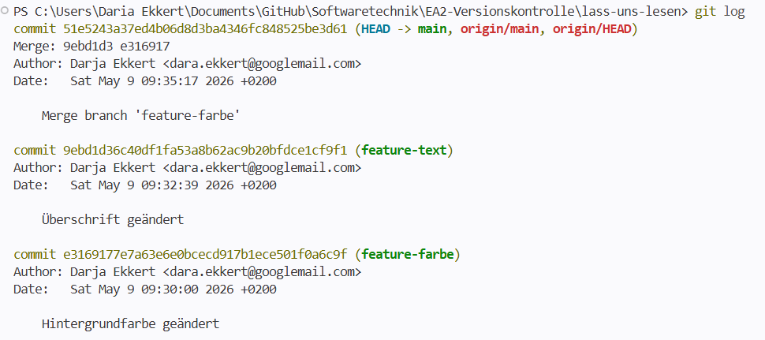
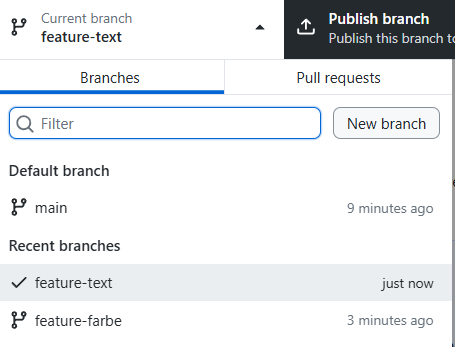
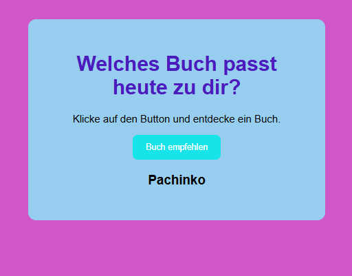
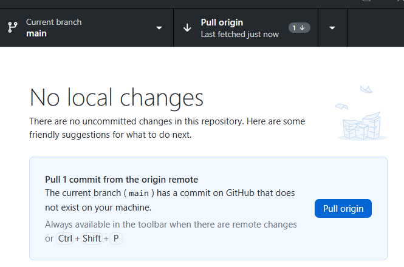

# EA2 – Versionskontrolle mit Git

## Aufgabe 1 – Repository erstellt

## Aufgabe 2 – Kleines Projekt erstellt

Für die Einsendeaufgabe wurde ein kleines Webprojekt
„Lass uns lesen“ erstellt.

Das Projekt empfiehlt zufällig Bücher per Button.

## Aufgabe 3 – git diff verwendet

Mit `git diff` wurden Änderungen im Projekt angezeigt.

Datei umbenannt

Die Datei `script.js` wurde in `buch.js` umbenannt.

Zusätzlich wurde die Referenz in der HTML-Datei angepasst.

## Aufgabe 4 – Zeitreise mit Git

Mit `git log` wurde die Projektgeschichte angezeigt.

## Aufgabe 5 - Branches und Merge
Es wurden zwei Branches erstellt:

- feature-farbe
- feature-text

Danach wurden die Änderungen wieder in `main` zusammengeführt.

## Test Text für Aufgabe 6

Pull / Fetch durchgeführt

Das lokale Repository wurde mit GitHub synchronisiert.

## Aufgabe 6 – Pull Request

Pull Request:
https://github.com/edlich/education/pull/603